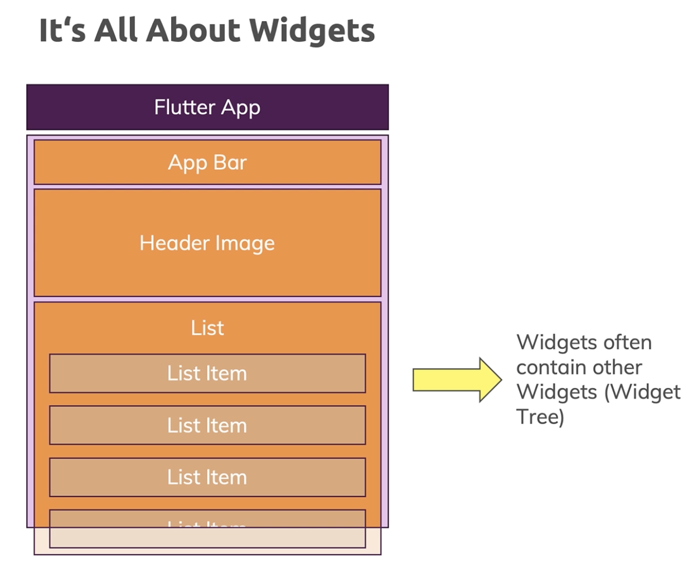
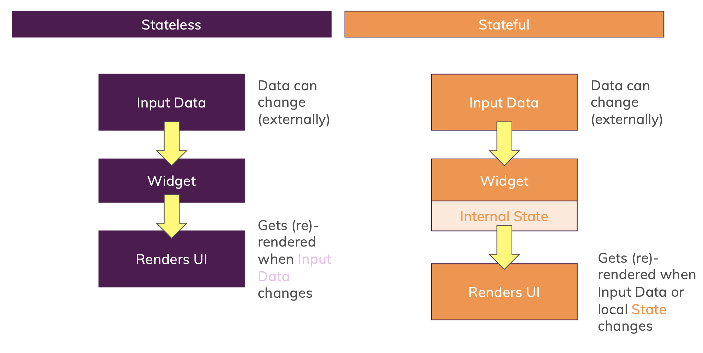
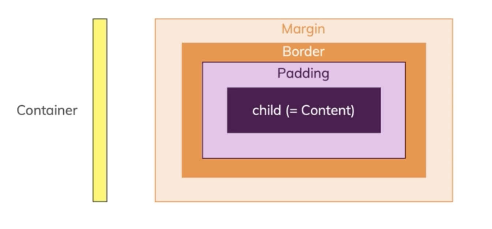

# Flutter Basics - Widgets & How Apps Are Built

## 1. Module Introduction

### 1) What's In This Section?
- How a Flutter App Starts & Works
- Working with Widgets & Building Custom Widgets
- Reacting to User Events
- Stateless & Stateful Widgets
- Dart Fundamentals

### 2) Creating a New Project

```
$ flutter create flutter_complete_guide
```

## 2. An Overview of the Generated Files & Folders
- .idea : holds some configuration for Android Studio.
- .vscode: extra configuration for your vscode
- android: complete android project as you could also create it without Flutter. when your Flutter code gets compiled to native code, it will basically get injected into this Android project which later will be built into a real Android app
- build: output of your Flutter application. You shouldn't change anything in there, that will all be done automatically by the Flutter SDK 
- ios: for the most part this is a passive folder which gets kind of merged with your Flutter code in the end and which will all be menaged by the Flutter SDK to get iOS application
- lib: where we will do 99% of our work. It is the folder where we will add all our Dart files
- test: automated test, 
- .gitignore 
- .metadata: managed automatically by Flutter. save some information by Flutter
- .packages generated automatically by Flutter SDK. you should not delete it
- [project_name].iml: it's also managed automatically by the Flutter SDK. it manage some internal dependencies and some settings for your project
- pubspec.lock
- pubspec.yaml: allows you to mostly manage these dependencies of your project. you can configure which other third-party packages. you can also configure some other things in here, like for example fonts or images you want to use 

<br><br>


## 3. Building an App From Scratch

### 1) Flutter is All about Widgets

Every Flutter app you're building is just a bunch of widgets.
widgets are the UI building blocks, things like the app bar, maybe some image or a list with list items.
widgets also often contain other widgets like that list which has list items.

Flutter app is tree of widgets which has a root widget and in there, you have other widgets which yet might hold other widgets 




<br>

To create a widget, we need to create a class. becuase a widget is a special type of class.

<br><br>

## 4. Building a Widget Tree
Flutter controls the entire UI, all the pixels on the screens are controlled by your flutter app

### 1) Scaffold
it will give you a basic design and structure and color scheme or coloring for giving you a UI that looks more like a regular mobile app page.
Scaffold also has a couple of named arguments. 


<br><br>

## 5. visible(Input/Output) & invisible(Layout/control) Widgets

### 1) invisible Widgets
- we don't see invisible widgets but which help us with structuring our content.
- this widgets give our app structure and control how visible widgets are drawn onto the screen

### 2) Different Types of Widgets


<br><br>


## 6. Updating Correctly with Stateful Widgets 
Using StatelessWidget is incorrectly

<br> 

### 1) Understanding 'State'
In general, state is Data / Information used by your app
that state will change in an application. 
**StatelessWidget** can't have state.


<br>


<br>

### 2) Stateless vs Stateful
**stateless widget**
has build method which is used to render the UI.
we can pass in data from outside into the stateless widget through the constuctor of that widget class.
when external data change and actually Flutter app would rebuild.
but inside of the widget class, the data will never change.
we can only receive new data from outside and that will basically rebuild the widget.

**stateful widget**
has build method that builds a widget and that renders a UI.
we can get our input data, so data passed in through the constructor of the widget.
but we also can have some internal state.
user interface will get updated by Flutter whenever either that external, that input data changed or when our internal state changed.

state를 변경하기 위해서는 setState({})를 사용한다.



<br>

### 3) setState
setState is a function that forces Flutter to re-render the user interface, however not the entire user interface of the entire app.
instead what set state does is calls build again of the widget.

rebuild but to not really render the entire UI again, so it does not redraw every pixel agin.
It just has its tools and its machanisms to find out what changed on the screen and what needs to be redrawn. and therefore it will find out that text here changed, that this widget changed and it will only update this text here in the end.

when you call set state, build is getting called and that is why you see the change.
That is also why you didn't see anything without set state because then you changed the data


<br><br>


## 6. Using private properties
State 클래스의 이름에 \_를 붙이면 public class에서 private class로 변경할 수 있다.
_MyAppState는 main.dart 파일 내에서만 접근 가능하며, MyApp 클래스에서만 접근할 수 있다.

이는 변수에도 적용되는데, 같은 파일 내에서만 접근할 수 있게 하고 싶다면 접두사로 \_를 붙이면 된다. 이는 Class의 private property와 같다.
마찬가지로 함수에도 적용할 수 있다. (private function)


<br><br>


## 7. First Styling & Layouting

```
return Container(
    margin: EdgeInsets.all(10),
    width: double.infinity,
    child: Text(
        'text', 
        style: TextStyle(fontSize: 28),
        textAlign: TextAlign.center
    )
);
```

- margin: spacing around the container

<br>

### 1) The container()
container widget is a special widget which actually has a bunch of settings that allow you to space things and to align things.
The core of the container always is the child, in our case that's the text widget.

However we can set up some padding, that is internal spacing inside of the container.
Now inside means that container also may have a border which marks the border of the container .
That border can be drawn, you can give it a color.
Outside of the border, you have that margin.
So that's the spacing around the container, between the container and neighboring elements.
so that overall makes up the container.





<br><br>


## 8. Multiple Constructors

```
Container(
    margin: EdgeInsets.all(10),
    ...
)

[edge_insets.dart]
const EdgeInsets.all(double value)
: left = value,
    top = value,
    right = value,
    bottom = value;
```

instead of directly adding parentheses thereafter, we add dot some name and that is a Dart feautre which allows you to define multiple constuctors per class.
Each constuctor create a new instance of this class but with different configurations, with different settings.
That make it easy for you create different EdgeInsets, which is basically a settings container setting up spaces, setting up different EdgeInsets container with different configuration with these utility functions here, with these utility constuctors.

```
// Dart

class Person {
    String name;
    int age;
}

Person({this.name, this.age = 30})

Person.veryOld(this.name){
    age=60
}

var p3 = Person.veryOld('Max')
```

<br><br>

## 9. Official Docs & The Widget Catalog
- [official Documentation](https://flutter-ko.dev/docs)

<br><br>

## 10. Passing Callback Functions Around
생성자를 통해 callback Function을 전달할 수도 있음. 이는 Function의 pointer를 전달하는 것으로, 즉시 실행하지 않고 trigger 될 때 실행할 수 있음

```
[main.dart]

  void _answerQuestion() {
    print('function')
  }

    return MaterialApp(
      home: Scaffold(
        appBar: AppBar(
          title: Text('My First App')),
          body: Column(children: [
            ...
            Answer(_answerQuestion),
          ],) 
      ),
    );

[answer.dart]
class Answer extends StatelessWidget {

  final Function selectHandler; // function

  Answer(this.selectHandler);   // constructor

  @override
  Widget build(BuildContext context) {
    return Container(
      width: double.infinity,
      child: RaisedButton(
        child: Text('Answer 1'), 
        onPressed: selectHandler,
      ),
    );
  }
}

```

<br><br>

## 11. Mapping Lists to Widgets
### 1) map() 
The map method executes a function which you have to pass as an argument to map on every element in the list which you're calling map.

```
questions[_questionIndex]['answers'].map((answer) {
    return Answer(answer);
})
```

in this case on every element in the question list.
That function automatically receives an argument itself.
this function will be executed for every element in the question list and the current element for the current function execution.
That is received as an argument inside of this function which is applied to every element.

so we get the single question, we have to return a new value because map returns a new list where we don't have to keep the old structure. 

**Note:** map does not change the original question list. it does not change this variable or the value in there. it generates a new list instead based on the old list and then the transformation we do in the body of that function will be passed to map.


위 코드는 Dart에서 에러가 발생한다. 에러를 고치기 위해 list를 wrapping 하는 작업이 필요하다.

```
(questions[_questionIndex]['answers'] as List)
```

Answer는 constuctor에서 string argument를 받는 부분이 없으므로 생성자의 2번째 인자로 answer를 추가해야 한다.

<br>

```
[answer.dart]

  final Function selectHandler;
  final String answerText;

  Answer(this.selectHandler, this.answerText);


[main.dart]

(questions[_questionIndex]['answers'] as List<String>).map((answer) {
    return Answer(_answerQuestion, answer);
})

```

map() 함수는 list를 리턴하지 않고 iterable을 리턴한다. 우리가 실제로 원하는 것은 iterable이 아닌 list이기 때문에 .toList() 함수를 추가하여 list를 리턴하도록 변경한다.

```
[main.dart]

(questions[_questionIndex]['answers'] as List<String>).map((answer) {
    return Answer(_answerQuestion, answer);
}).toList()

```

<br>

하지만 여전히 문제가 남아있다. 위의 코드는 List<Answer>로 리턴되지만 우리는 Widget 타입이 필요하다.
이를 위해 코드 앞에 ...을 추가하여 List를 해체한다.

```
[main.dart]

...(questions[_questionIndex]['answers'] as List<String>).map((answer) {
    return Answer(_answerQuestion, answer);
}).toList()

```

<br>

아래는 Dart의 triple dot(...) spread operator 예제이다.

```
List<int> l1 = [1, 2, 3];
List<int> l2 = [4, 5];
List<int> result = [...l1, ...l2];
print(result);
```

Output: [1,2,3,4,5]

<br><br>

## 12. final vs const

- **final**: runtime constant value. it depends on the concrete instance we create. can't change runtime.
- **const**: compile time constant value, not runtime constant. can't change compile time.

```
    const questions = [];

    questions = const []

```

위 코드에서 둘의 차이점은 위 코드는 variable이 constant이고, 아래는 value가 constant이다.
what Dart actually stores in the variables are the pointers at the objects in memory, so the addresses of the objects in memory.

```
var dummy = ['Hello'];
dummy.add('Max');       // unlike map, it modify the original list ay adding a new item.
print(dummy);  // [Hello, Max]

// value constant : this is not work.
var dummy = const ['Hello'];
dummy.add('Max');
print(dummy);   
```

<br><br>

## 13. Introducing 'if' statements
현재까지의 앱은 세번째 질문에서 답을 누르면 index 관련 에러가 발생한다. 이 에러를 해결하기 위해 _answerQuestion() 함수에 if 조건을 추가하고, 
if(_questionIndex < questions.length) 조건문을 추가하려고 한다. 하지만 questions가 build() 메소드 scoped의 변수이므로, _answerQuestion() 함수에서는 접근할 수 없다.
이 때문에 const questions을 _MyAppState 클래스 범위의 변수로 변경하여 _answerQuesion() 메소드에서도 접근할 수 있도록 한다.

하지만 클래스 범위의 변수는 const 키워드를 사용할 수 없다. 이를 위한 두가지 해결 방법이 있다.

- 1) const 키워드 앞에 static 키워드를 추가한다 (static const questions)
- 2) const -> final로 변경 (final questions = const []  // never change)

<br><br>

## 14. Outputting Widgets Conditionally
삼항연산자 사용

<br><br>

## 15. Splitting the App into Widgets

### 1) Should I Split It?
It's better to have smaller widgets than large widgets. 
Quiz() 위젯과 Result() 위젯 생성

<br><br>

## 16. Getter
unlike in a method, you now don't add () because a getter is like a method that can never receive any arguments.
you do add a body, you have return a value

we will use 'resultPhrase'. it doesn't need parentheses () to execute it like a function.
and This also not using it as the address of a function because this is not function, This is simply Dart feature.


```
// result.dart

  @override
  Widget build(BuildContext context) {
    return Center(
      child: Text(
        resultPhrase, 
        style: TextStyle(fontSize: 36, fontWeight: FontWeight.bold),
      )
    );
  }
```

<br><br>

## 17. Summary

<image src="./images/summary.png" width="700">
